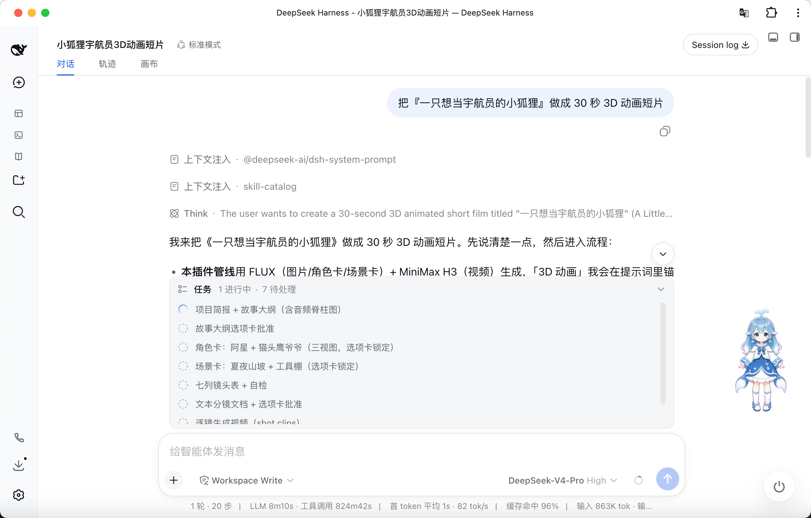
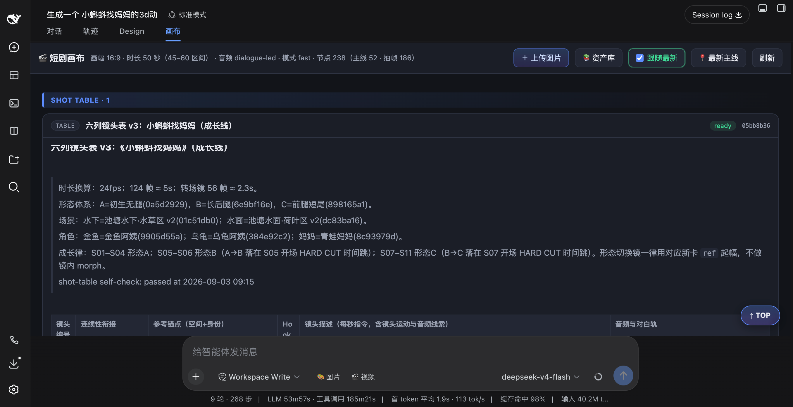
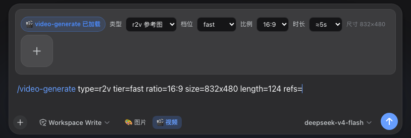
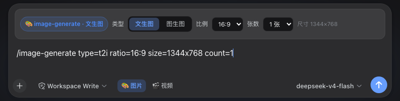
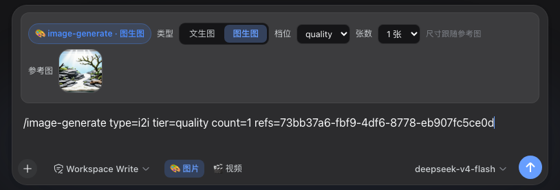
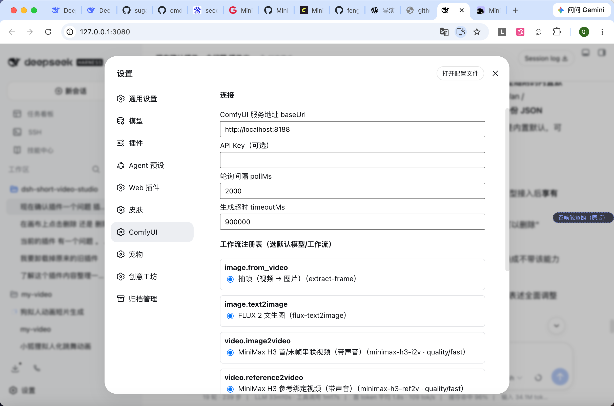
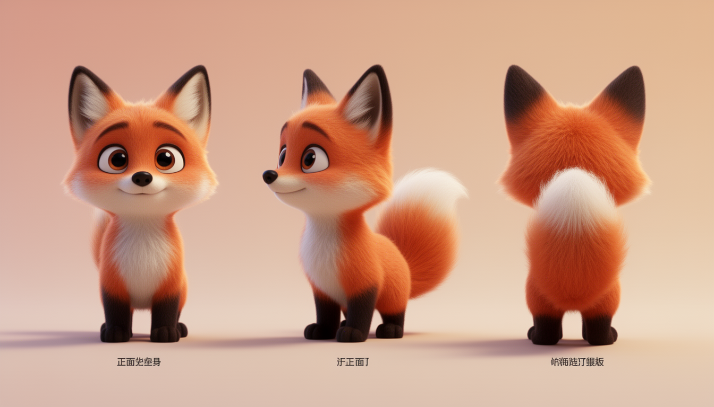
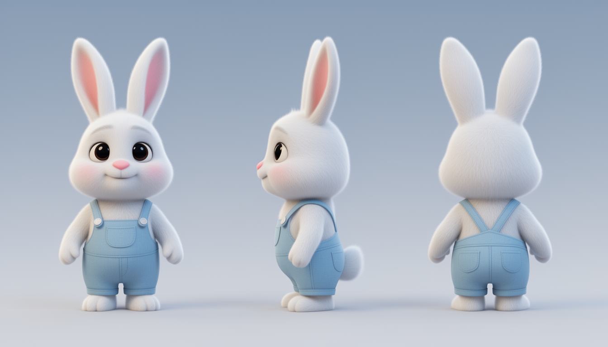

# dsh-short-video-studio
[](https://dsh-plugin.org/plugins/fengyungithub/dsh-short-video-studio)

**完全本地 · 免费 · 零云端依赖**的**短剧 / 动画画布工作室**，作为 [DeepSeek Harness](https://github.com/deepseek-ai) 双面插件运行。所有生成都跑在**本地 ComfyUI** 上——不需要任何付费云 API、不消耗额度，装好即用，一次生成、无限出片。

> 一句话：**Agent 按你定义的 skill 编排流程，把生成请求派发到本地 ComfyUI 执行，产物落进可视化画布，还能通过飞书远程操控创作。**

> **🌟 模型无关**：FLUX 2 / MiniMax H3 只是插件随附的**内置默认工作流**，不是产品边界。本插件是通用的 ComfyUI 工作流执行器 + 能力注册表——**任何 ComfyUI 能跑的模型**（SDXL / SD3.5 / Qwen-Image / Wan / CogVideoX / LTX / 本地 Kling 等，图片或视频、带不带声音都可以）都能通过[导入一份工作流清单](#导入你自己的-comfyui-workflow)接入，skill 与工具契约无需任何改动。换模型 = 加一份 JSON。

## 功能亮点

### 🖥️ 本地化、0 成本的视频工作流

- **零云端依赖**：默认图片用 FLUX 2、视频用 MiniMax H3 **音视频 AV 模型**（**带声音**、支持**参考图绑定**与**画面内原生字幕**，对白直接写进 prompt，无需后期叠加）——两者都只是内置默认，可整体替换为你自己的任何 ComfyUI 模型/工作流。
- **画质/速度三档（tier）**：视频 `fast`（调试 / 调构图，长边 832）· `balanced`（日常，画质与耗时平衡，长边 1344）· `quality`（成片，长边 1344）；旧参数 `mode=` 为兼容别名。**加速不暴露到产品层**——设置页每个能力只有一条**内置默认策略**，其余策略由你自己命名与组合（见下）。图生图仍走 `fast` / `quality` 的 mode 轴（图片清单未分档）。分辨率按画布比例自动推导，支持 16:9 / 9:16 / 1:1 等任意画幅，snap32。
- **图片双模（文生图 / 图生图）**：t2i 用 FLUX 2 直接出卡（角色卡 / 场景卡 / 分镜图），i2i 用 FLUX 2 ReferenceLatent **改绘**——保持主体不变、换背景 / 场景 / 画风 / 去水印；单张参考图、尺寸跟随参考图（≤1MP），`quality`（20 步无 LoRA，保真）/ `fast`（8 步 Turbo LoRA，调试快），可一次出 1–4 张。
- **同场景续接镜「续得上」**：`continuity_from=上一镜节点 id` ⇒ **链式续接**——把上一镜的**服务端 latent 直接钉进本镜**（画面逐帧接住它的结尾、**音频从接缝继续**，实测接缝画面差 **2.6–7.0**，无续接对照 **32–68**），不需要上传图片、也不吃画质。**r2v 与 i2v 两侧都支持**（i2v 链式实现另见下），跨形状续接（上一镜 r2v → 本镜 i2v）同样可用。链的硬约束见[档位与加速策略](#档位tier与加速策略)与 [`docs/shot-chain-continuity.md`](docs/shot-chain-continuity.md)。
- **完整后处理**：同场景续接（链式 latent 或末帧串联）、生成式转场镜、抽帧、拼接合成（本机有 ffmpeg 走零重编码，否则 ComfyUI 纯节点链路）——一条龙出片。

### 🎨 可视化画布

- 每个会话多一个「**画布**」tab，按生产顺序预览 / 编辑 / 重做每一步产物：简报、大纲、角色卡、场景卡、镜头表、分镜、逐镜片段、成片。
- 文本节点**实时渲染 markdown**（标题/表格/列表/代码块），媒体节点直接内嵌预览；分组、排序、删除、**入库**（一键登记为跨会话资产）都在画布上完成。
- **自己添加资产**：画布顶栏「＋ 上传图片」可直接把本地 png/jpg/webp/gif 传成角色卡/场景卡等资产节点（无需先生成）；「📚 资产库」带缩略图把已入库的跨会话资产取到当前画布，之后即可作为 ref 参考直接驱动视频生成。
- **生成的卡也能编辑替换**：已生成/已入库的角色卡、场景卡上点「编辑」→ 选本地图即可替换该卡图片（节点/标题/分组保留；若已入库会解除绑定，替换后按需重新「入库」登记新版本）。
- **输入框视频生成（`video-generate` skill 的可视化入口）**：会话输入框工具行左端保留「🎨 图片 / 🎬 视频」开关。点「🎬 视频」即把 **`/video-generate` 斜杠命令（内联 `type/tier/ratio/size/length/refs/first/last` 参数）写入官方输入框**，用 dsh 原生 skill 加载机制加载内置 `video-generate` skill；同时在输入卡上方弹出**紧凑工具条**——类型 **r2v（参考图生成）/ i2v（首/末帧生成）**、**档位下拉（选项来自档位矩阵，带实测耗时）**、比例、时长（原生下拉菜单）与「参考图 / 首帧 / 末帧」自定义上传元素（经 `/canvas/upload` 落为画布节点；dsh 原生附件无法端到端转成 `ref_nodes`，故保留自定义图片输入）。**prompt 接着写在官方输入框空行后**，改参数时工具条自动重写命令行、保留 prompt；**发送直接点 dsh 默认发送键**（提交整条草稿，不额外做发送按钮、不劫持 Enter），Agent 按对应 skill 解析命令行参数并调用生成工具出片，产物回进对话并落画布。图片生成（🎨 `image-generate`）同机制：工具条切换 **文生图（t2i）/ 图生图（i2i）**——t2i 选比例与张数（默认 1344×768，可 1–4 张）；i2i 上传**单张参考图**（图 chip + ➕ 新增格，与 dsh 原生上传同款 64px 样式）、选 **quality / fast 档**与张数，命令头自动写 `/image-generate type=… tier=… refs=<画布节点id>`。**档位按模式独立记忆**：视频默认 `fast`（调试快）、图生图默认 `quality`（保真优先），手动选过后各自记住；上传的参考图即画布节点（删除/切型/清空草稿都会同步清理，画布不残留）。
- Agent 工具与画布页读写**同一份持久状态**，对话推进的每一步产物都实时可见。

### 🧩 自由扩展：skill 与 workflow

- **skill 可扩展 + 随插件升级自动更新**：生产流程完全由 skill 定义（安装时复制到 `~/.dsh/skills/`，带**版本戳**：内容没被你改过就随插件升级自动刷新，你改过就**只提示、不覆盖**）。写一个 `SKILL.md` 就能定义你自己的片型流程——**插件本体不认识任何流程、任何片型词汇**。
- **workflow 可扩展**：插件退化为「通用 ComfyUI 工作流执行器 + 能力注册表」。**换模型、换工作流 = 增删一份 JSON**，不动 JS、不动工具、不动系统提示。FLUX 2 / MiniMax H3 只是内置默认，你的任何 ComfyUI 工作流（SDXL / Qwen-Image / Wan / CogVideoX / LTX…）都可以**直接导入**并设为默认（见[导入你的 workflow](#导入你自己的-comfyui-workflow)）。

### 🎬 多场景创作：一套引擎，任意场景

- 默认内置 **3D 动画短片**场景（故事创意 → 角色/场景/镜头/分镜/逐镜/合成），但**场景不是插件边界**。
- **电商宣传视频**（商品/卖点 → 展示分镜 + 口播）、**教育课件讲解**（知识点 → 图解 + 讲解）、品牌故事、纪念短片、Vlog 解说……任何「输入 X → 产出视频」的创作场景，都通过**扩展一个 skill** 覆盖——复用同一套画布、生成工具、资产库与飞书交付，只换编排规则（见[开发你自己的场景 skill](#扩展开发你自己的场景-skill)）。
- **场景与模型双解耦**：场景由 skill 定义、模型由注册表定义，两者互不绑定——电商场景也可以随时切换到你想用的任何 ComfyUI 模型。

### 📱 飞书集成：远程操控工作台创作

- 会话可以跑在**飞书聊天**里（配合 [dsh-lark](https://github.com/deepseek-ai) 飞书渠道）——你在飞书里说一句话，Agent 就在本地工作台上按 skill 走完整条流水线。
- 每次提问前，插件**自动把画布产物送达飞书**：图片/视频直接发原文件，简报/大纲/镜头表/分镜等文本自动导出为 **PDF**（飞书可直接预览）——无需登录任何后台，聊天里就能收片、审片、下指令重做。

**安装说明**：dsh-lark 飞书渠道是 **web profile 的插件**，安装时必须带 `--profile web`；若希望**飞书与 dsh web 共用同一个 profile**（同一份插件、会话与工作区，Web 画布与飞书聊天看到同一块画布）：

```bash
dsh plugin --profile web add dsh-lark-channel@latest
```

装好后在飞书里把 bot 拉进群即可开始远程创作；群聊会先弹审批卡、再出选项卡。

## 快速开始

前置条件：本机或者远程主机已运行 [ComfyUI](http://localhost:8188)，并已下载你计划使用的模型——内置默认（FLUX 2 / MiniMax H3）或你自己导入的模型（见[配置](#配置)与[导入 workflow](#导入你自己的-comfyui-workflow)）。

```bash
# 安装插件（三种来源任选其一；npm 为正式发布渠道，推荐）

# ① npm（正式发布，随版本自动更新安装源）
dsh plugin --profile web add dsh-short-video-studio
# ② GitHub（最新源码）
# dsh plugin --profile web add github:fengyungithub/dsh-short-video-studio
# ③ 本地源码（开发用）
# dsh plugin --profile web add file:/path/to/dsh-short-video-studio

dsh web   # 重启后会话出现「画布」tab；自带 skill 已自动装到 ~/.dsh/skills/
```

安装后自动完成三件事：`skills/` 下 skill 复制到 `~/.dsh/skills/`（**版本戳刷新**：每个副本的 `.dsh-studio-manifest` 记下插件版本 + 内容哈希，内容被你改过就只提示、绝不覆盖，没改过才随插件升级刷新；`DSH_SVS_SKILL_REFRESH=off` 关掉刷新、`=force` 连改过的也覆盖）；Web 设置页新增 **ComfyUI** 配置菜单；会话多出「画布」视图 tab。

开始创作：在会话里说

> 把「一只想当宇航员的小狐狸」做成 30 秒 3D 动画短片

Agent 会按 skill 定义的流程推进：项目简报 → 故事大纲 → 角色卡 → 场景卡 → 镜头表 → 分镜 → 逐镜生成 → 拼接合成，关键节点用选项卡确认。产品界面（真实会话截图）：

| 对话体验：流程叙述 + 任务看板 | 对话体验：可视化画布 |
|---|---|
|  |  |

### 输入框生成条（真实 UI 截图）

会话输入框工具行左端「🎨 图片 / 🎬 视频」开关，点开后即在官方输入卡内弹出紧凑参数条，命令头自动写入草稿首行、prompt 写在空行后，直接走 dsh 原生发送键提交（截图均为真实会话）：

| 🎬 视频生成（r2v · 默认 fast 档） | 🎨 图片 · 文生图（t2i） | 🎨 图片 · 图生图（i2i · 参考图 chip） |
|---|---|---|
|  |  |  |

视频条：类型 **r2v（参考图）/ i2v（首/末帧）** · 档位 **来自档位矩阵**（能力有几个档、每档长边与耗时全部读注册表 —— UI 不预设档位数量与名称，默认取该能力首个可用档）——**矩阵未加载时不猜档位，命令行也不拼 `tier=`（交给服务端按清单解析）**，并显示解析到的实现 id、加速标记与缺节点告警 · 比例 · 时长，参考图/首帧/末帧可上传画布节点。图片条：类型 **文生图 / 图生图**——t2i 选比例（1344 长边）+ 张数；i2i 传**单张参考图**（尺寸跟随参考图）、档位默认 **quality**、可出 1–4 张。

## 架构概览

完整设计文档见 [`docs/ARCHITECTURE.md`](docs/ARCHITECTURE.md) 与 [`docs/workflow-contract.md`](docs/workflow-contract.md)。核心分层：

```
┌──────────────────────────────────────────────────────────────┐
│ 展示层（浏览器半）  lib/client.js + studio/                     │
│  「画布」会话 tab + 「ComfyUI」设置页（配置 / 注册表 / 导入）      │
├──────────────────────────────────────────────────────────────┤
│ 契约层（纯数据 + 校验）  workflows/*.json + lib/manifest.js      │
│  能力词汇表 · 注入原语 · $assets 占位 · $model 哨兵 · 强校验     │
├──────────────────────────────────────────────────────────────┤
│ 执行层（宿主半）  lib/index.js                                 │
│  ComfyUI 客户端 · 渲染编排 · 分辨率策略 · 注册表解析 · 画布存储  │
├──────────────────────────────────────────────────────────────┤
│ 集成层                                                        │
│  Agent 工具注册 · GUIDANCE · HTTP 路由 · skill 安装 · 渠道送达  │
└──────────────────────────────────────────────────────────────┘
```

**设计主张：插件不认识「FLUX」「H3」这些名字，只认识能力（capability）与工作流清单（manifest，数据而非代码）**——FLUX 2 / MiniMax H3 只是注册表里「恰好是默认」的两条记录，任何模型接入后享有同等地位。三层正交契约：

| 层 | 内容 | 载体 |
|---|---|---|
| ① 任务契约 | Agent 只描述「要什么」：capability + 类型化输入 | Agent 工具参数 |
| ② 能力契约 | 抽象作业词汇表：`image.text2image` / `video.reference2video` / `audio.tts`…（开放集合） | `CAPABILITIES` |
| ③ 工作流绑定契约 | 一份清单 = 一个 capability → 一个 ComfyUI 图 + 注入点 + 资产 + 质量档（**JSON 数据**） | `workflows/*.json` |

清单里的 `$assets.<key>` 占位让「换模型文件只改配置」；`["$model", 0]` 哨兵让「按质量档插 LoRA 链」由编译期自动完成。**注册表来源优先级**：内置 `workflows/` < 用户 `~/.dsh/dsh-short-video-studio/workflows/`（同名遮蔽）< `assetOverrides` / 环境变量（换模型文件名，不动图结构）。

## 目录结构

```
├── lib/
│   ├── index.js          # 宿主半：ComfyUI 客户端、渲染编排、画布存储、路由、Agent 工具、GUIDANCE
│   ├── manifest.js       # 契约引擎：能力词汇、manifest 校验、图编译、注册表加载
│   ├── concat.js         # 视频拼接（ffmpeg 优先 / ComfyUI 纯节点退化）
│   ├── convert.js        # ComfyUI「导出 API」JSON → workflow manifest 转换器
│   ├── assets.js         # 跨会话资产库（角色卡 / 场景卡 / 风格锚点）
│   ├── pdf.js            # 文本节点 → PDF（puppeteer-core 优先，CLI 兜底）
│   └── client.js         # 浏览器半：画布 tab + ComfyUI 设置页
├── studio/               # 画布页（自包含 HTML/CSS/JS，无构建）
├── workflows/            # 内置工作流清单（数据，非代码）
├── schemas/              # workflow-manifest 权威 JSON Schema
├── skills/               # 自带 skill（安装时复制到 ~/.dsh/skills/）
├── docs/                 # 架构 / 契约 / 实验报告
└── scripts/              # 冒烟 / e2e / 导入转换 / 模板生成（h3-templates → workflows）与实测（bench-h3）脚本
```

## 内置工作流清单（默认，可替换）

> 下表是插件随附的**内置默认**。导入你自己的清单后即可通过 `preferred` 把它设为某能力的默认工作流——内置清单可以不用、可以遮蔽、可以删除。

| 清单 | 能力 | 说明 |
|---|---|---|
| `flux-text2image` | `image.text2image` | FLUX 2 文生图（角色卡 / 场景卡 / 分镜图）。**未分档**（清单未声明 `tier`，不传档位） |
| `flux2-img2img` | `image.image2image` | FLUX 2 参考图改绘（ReferenceLatent，尺寸跟随参考图）。**未分档**：走 `mode` 轴（`quality` 20 步 / `fast` 8 步 Turbo LoRA） |
| `minimax-h3-ref2v-fast` · `-balanced` · `-balanced-sol` · `-quality` · `-quality-sol` | `video.reference2video` | **组「MiniMax H3 参考生成视频」**：H3 参考绑定，`ref_nodes` 绑定身份/环境，**带声音**。一个 json = 一个档位实现；`fast` 长边 832，`balanced`/`quality` 长边 1344 |
| `minimax-h3-i2v-fast` · `-balanced` · `-balanced-sol` · `-quality` · `-quality-sol` | `video.image2video` | **组「MiniMax H3 首末帧生成视频」**：H3 首/末帧串联（同场景续接镜 / 转场镜），带声音，**base = FL2VA 变体**。一个 json = 一个档位实现；`fast` 长边 832，`balanced`/`quality` 长边 1344（`balanced` = 8 步 + fl2v 768p LoRA，shift 6/3） |
| `minimax-h3-ref2v-ctx-fast` · `-balanced` · `-balanced-pdd` · `-quality` | `video.reference2video` | **组「MiniMax H3 参考视频·链式续接」**：与同档标准实现**同一批权重**，只多挂 Motion Context 四节点 ⇒ 传 `continuity_from` 时继承上一镜尾部（22 帧画面 + 1.000s 音频），采样多 22 帧后裁掉。**`priority: -100`**：只被「续接路径」或显式 `workflow=` 选中，不做隐式默认 |
| `minimax-h3-i2v-ctx-fast` · `-balanced` · `-balanced-pdd` · `-quality` | `video.image2video` | **组「MiniMax H3 首末帧·链式续接」**：i2v 版链式实现（模板由 `scripts/make-h3-ctx-templates.mjs` 从普通 i2v 模板派生）。**实测行为**：链式 i2v 里 **`first_frame_node` 会被丢弃**（钉住的 head 已决定开头约 22 帧）、**`last_frame_node` 保留** ⇒ 转场镜「续接上一场景尾镜 + 末帧锚定下一场景首镜」是当前最优解。同样 `priority: -100` |
| `minimax-h3-ref2v-balanced-pdd` · `-balanced-pdd-sol` | `video.reference2video` | **PDD 8 步蒸馏**（`nfe=8`）：**8 步拿到成片档以上细节**（ref2v 184.7s / 叠 Sol 137.3s）。就是普通清单，归在同一家族组里；**不做隐式默认**（`priority<0`，依赖第三方节点），要在配置页「新增策略」里组合并自己命名 |
| `minimax-h3-i2v-balanced-pdd` · `-balanced-pdd-sol` | `video.image2video` | 同上（FL2VA 权重，base 必须 fl2va）。i2v 侧 178.8s / 叠 Sol 134.1s，定位是**成片档的廉价替代**（392.4s → 178.8s） |
| `extract-frame` | `image.from_video` | 抽帧（末帧 / 首帧 → 图片节点） |
| `minimax-h3-ref2v-sol-stats` | `video.reference2video` | **内部诊断清单**（`internal: true`）：跑 Sol 时输出统计用于复核。**不参与档位解析、不进 UI 与技能选项**，只能显式 `workflow=` 调用 |

### 档位（tier）与加速策略

- **视频形状 `type` 必填**：`comfy_generate_video(type='r2v', …)`（参考绑定，配 `ref_nodes`）或 `type='i2v'`（首末帧串联，配 `first_frame_node`）。形状与参数冲突**直接报错并给修法**（此前是静默丢弃参数）；形状与续接（`continuity_from`）正交，详见 `docs/video-shape-contract.md`。
- **产品层档位是受控三档**：`fast`（调试 / 调构图，长边 832）/ `balanced`（日常，画质与耗时平衡，长边 1344）/ `quality`（成片，长边 1344）。呼叫 `comfy_generate_video(tier=…)` / `comfy_render(tier=…)`；**旧参数 `mode=` 保留为兼容别名**（`mode=fast|balanced|quality` 与 `tier` 等价）。缺省是 `quality` —— **成本最高，技能与手工调用都建议显式传 `tier=`**。
- **请求了不存在的档位不会静默换档**：如 i2v 请求 `tier=balanced` → 工具**显式报错并列出可用档位**，改请求可用档位即可（不要原样重试）。
- **分辨率读清单（长边）+ 画布比例推导**：`fast` 长边 832、`balanced`/`quality` 长边 1344；工具条会显式传 `size=WxH`（显式优先）。长边由**清单**声明，UI 不按档位名硬编码。
- **策略与档位的关系**：策略就是把「哪些档用哪份清单」存成一套并起个名；点选后写入配置 `tiers`（快照语义）。**策略声明了它提供哪些档位**——只挑了 balanced 的策略就没有 fast/quality，工具条不显示、请求会显式报错。逐档下拉＝不命名的临时组合（显示为「自定义」，此时未选档位才回退到注册表首选）。两者都随时可改，技能侧始终只传 `tier`。
- **链式续接（`continuity_from`）怎么用**：同场景后续镜传 `continuity_from=上一镜的视频节点 id`；该镜**必须**用声明了 `chain` 的实现渲染（各能力的 `…-ctx-*` 清单，或配置/显式 `workflow=` 指到它们）——上一镜没有链式序号时会**显式报错**，不会悄悄退化成"另起一镜"。硬约束：① **链的一条内分辨率与档位必须一致**（latent 不能缩放，跨档显式报错）；② **首镜（起链）也得用链式实现**，否则下一镜接不上；③ `length` 填**交付帧数**（续接实现自己多采 22 帧再裁掉）；④ 跨场景**不要**续接，直接换镜。成本：续接镜比同档标准实现慢约 **1.3–1.5×**（i2v `fast` 实测 40.4s vs 30.5s，多采 22 帧 + 多一组上下文 conditioning）。
- **加速不暴露到产品层**：设置页每个能力默认只放**一条内置默认策略**（跟随注册表首选 = 各档非加速首选实现）。**技能与文档只写 `tier`，不写加速实现 id 或节点名。**
- **策略由你自己命名与组合**：点「＋ 新增策略（命名 + 逐档组合）」→ 起名 + 逐档从现有清单里挑（可按家族跨清单组合，例如 balanced 用 PDD+Sol、quality 用标准），保存即选用；之后可重命名/删除。**只挑一个或两个档位也行**（≥1 即可）——**没挑的档位不属于这条策略**：配置页的逐档区与工具条档位下拉都会跟着收敛（没这个档位就连行都不显示），**显式**请求那个档位会报错（不会回退到别的实现），**不写档位**时则按这条策略提供的最靠前那档走（并给提示）——所以「只把 balanced 换成 PDD」得到的是一条"只有 balanced"的策略，想三档都能出就用策略行的「编辑档位」把三档都挑上。Sol / PDD 都只是**可选清单**，不会被自动包装成"官方策略"。逐档下拉也随时可用（不保存为策略时显示为「自定义」）。
  - ⚠️ Sol 清单**需自装第三方节点** [ComfyUI-SolAttn-Ampere](https://github.com/cicalooo/ComfyUI-SolAttn-Ampere)（注册名 `SolAttnMiniMaxH3`，没装会报 node type not found）；缺节点时该实现**置灰不可用**（不静默回退到标准实现）。
  - **同 seed 关/开对照实测**：成片档 20 步 768p 收益最大——ref2v 396.6s→311.2s（**1.27×**）、i2v 394.8s→314.7s（**1.25×**），高频细节持平（±2.5%）；`balanced` 8 步 166.3s→136.3s（1.23×）；**480p / fast 档只有 1.03× 且高频细节 −13.8%，不要开**。⚠️ 本插件栈**必须 `dense_first_percent: 0`**（默认 0.2 会让节点把每次调用判为"去噪早期"而**完全不稀疏**）；诊断清单可复核 `sol_attn>0`。⚠️ **同 seed 不再复现同像素**（注意力内核换了，即使不稀疏也差 15.1/255）→ 一部片子里要一致地全用或全不用，不能逐镜混用。由 `node scripts/make-h3-variants.mjs` 从 `scripts/h3-templates/` 生成，详见 `docs/minimax-h3-acceleration-lora.md` §9.8 与 `docs/tier-strategy-design.md`。

### 实测耗时（16:9 · 124 帧 ≈ 5.17s）

| 能力 | `fast` | `balanced` | `balanced` 带加速 | `quality` | `quality` 带加速 |
|---|---|---|---|---|---|
| ref2v（832×480 / 1344×768） | 24.6s | 166.3s | 136.3s | 396.6s | 311.2s |
| i2v（832×480 / 1344×768） | 26.1s | 177.3s | 130.5s | 394.8s | 314.7s |

> 耗时随硬件、驱动、模型文件版本而变，上表只作**量级参考**（决定选哪一档、加速值不值得开）。

**续接镜（`…-ctx-*`）**：同一档位下比标准实现慢约 **1.3–1.5×**（多采 22 帧 + 一组 Motion Context 条件）。i2v `fast` 实测：起链 36.4s / 续接 40.4s（同档标准 i2v `fast` 对照 30.5s）。

**PDD 清单**（长边 1344，需自己在设置页组进策略）：ref2v **184.7s** / 叠加 Sol **137.3s**；i2v **178.8s** / 叠加 Sol **134.1s**。同条件下的 20 步成片档为 394.4s / 392.4s（PDD 的锐度还高 +10.3% / +7.9%）→ **PDD 相当于用 8 步的钱买 20 步的画质**。

画质：`balanced`（8 步）帧锐度比 `quality`（20 步）高约 13%；`fast` 档细节最弱、适合调构图 / 走位；PDD 8 步则**高于**成片档。


> **⚠️ 版本兼容（v0.1.x → 现在）**：组 `minimax-h3-i2v`（拆分后是多份单档清单，见上表）的 base 已从 `minimax_h3_ref2va_pruned_int8_convrot` 换成 **`minimax_h3_fl2va_pruned_int8_convrot`（+21GB 下载）**，LoRA 换成 `minimax_h3_fl2v_lightx2v_turbo_4step_v0.1_comfy`（+2GB）。原因是原先 i2v 用 Ref2VA base 跑 `MiniMaxH3ImageToVideo` 属**跨变体错配**（拿不到 fl2v 系迭代红利）。这两个资产现在由**独立配置键**驱动（`models.h3FlUnet` / `models.h3FlFastLora`，或 env `DSH_SVS_H3_MODEL_FL` / `DSH_SVS_H3_LORA_FL_FAST`）——旧键 `h3RefUnet` / `h3FastLora` **只作用于 ref2v 档**，不再被 i2v 复用。若不想多下 21GB，用配置把它按旧组合钉回去即可（i2v 会退回旧行为）：
>
> ```jsonc
> "assetOverrides": {
>   "minimax-h3-i2v-quality": {
>     "unet": "minimax_h3_ref2va_pruned_int8_convrot.safetensors",
>     "fast_lora": "minimax_h3_ref2v_turbo_4step_v0.1_comfyui_bf16.safetensors"
>   }
> }
> ```
>
> **旧 id 的配置无需改写**（P2 迁移已内置）：`assetOverrides` 按族继承——新 id 会同时读旧 id 的覆盖（`minimax-h3-ref2v-*` 继承 `minimax-h3-ref2v`，`*-balanced*` 额外继承 `minimax-h3-ref2v-8step`，`minimax-h3-i2v-*` 继承 `minimax-h3-i2v`），且精确匹配新 id 的覆盖优先级更高；旧 `models.*` 键也按族映射到各档清单。所以你**不必**逐档重写配置。
>
> **⚠️ LoRA 与 shift 必须配对**（硬约束）：544p 系 LoRA（`ref2v/fl2v 4step v0.1`）= shift **12/3**；768p 系 LoRA（`*_8step_v1.0_768p`、`fl2v v1.1/v1.2 768p`）= shift **6/3**，且分辨率必须进 768p 训练域（本插件用 1344×768）。错配不是"略糊"而是**结构性崩坏**。shift 写在清单 `graph` 里（`modes` 不支持按档改标量），所以**换档位 pairing 的正确做法是加一份新清单**。

## Agent 工具契约

| 组 | 工具 |
|---|---|
| 生成 | `comfy_generate_image` · `comfy_generate_video` · `comfy_render`（通用入口，模型无关）· `comfy_list_workflows`（查能力/工作流） |
| 后处理 | `extract_frame`（抽帧）· `video_concat`（拼接成片） |
| 画布 | `canvas_list_nodes` · `canvas_write_node` · `canvas_get_node` · `canvas_group_nodes` · `canvas_reorder` · `canvas_get_state` · `canvas_set_state` |
| 资产 | `asset_list` · `asset_to_canvas` |

> 全部工具**模型无关**：capability 由注册表 `preferred` 解析到具体工作流，prompt 与流程里不硬编码模型名。

## 扩展：开发你自己的场景 skill

**适配场景**：插件默认内置两种场景 skill——**3D 动画短片**（故事创意 → 角色/场景/镜头/分镜/逐镜/合成）与**品牌宣传短片**（品牌素材 → 事实核验/创意方向/镜头表/逐镜/合成）。但**场景不是插件边界**——任何「输入 X → 产出视频内容」的创作场景，都能通过扩展 skill 覆盖，复用同一套执行层工具（生成 / 画布 / 资产 / 拼接 / 飞书交付），只换编排规则：

| 场景 | 输入 | skill 定义的编排重点 |
|---|---|---|
| 3D 动画短片（内置） | 一句话故事创意 | 角色一致、场景连续（**七列镜头表含「续接」列 + 链式续接**）、镜头表十项自检门、H3 原生字幕 |
| 品牌宣传短片（内置） | 品牌素材 / 推广目标 | 身份核验、来源清单、LOGO 首帧锁定、H3 原生画面文案 |
| **电商宣传视频** | 商品 / 卖点文案 | 产品展示分镜、口播逐字稿、卖点高光镜、BGM 与节奏 |
| **教育课件讲解** | 知识点 / 讲义 | 图解卡片、讲解分镜、字幕与口型绑定、节奏控制 |
| 品牌故事 / 纪念短片 / Vlog 解说… | 素材与主题 | 按你的业务规范自定义 |

每个场景 skill 就是一个 `SKILL.md`（纯文本编排规则），插件对它零认知——触发哪个 skill 就完全按它执行。三步即可定义一种新场景：

1. **在 `~/.dsh/skills/` 下新建目录**（或本仓库 `skills/` 下），写 `SKILL.md`，frontmatter 声明触发条件：

```markdown
---
name: my-niche-skill
description: 把 X 素材做成 Y 风格短片的完整流程。当用户提到「X 转 Y 短片」时使用。
whenToUse: 适用于……不适用于……
---

## 生产流程
1. 开场：用 canvas_set_state 声明画幅/时长/音频模式与分组展示顺序
2. 用 comfy_generate_image 建角色卡/场景卡（单视图、零文字）
3. 用 comfy_generate_video(type=…, tier=…) 逐镜生成（fast 调试 → quality 成片）
4. 用 video_concat 拼接，交付前把文本要点写进回复（飞书自动送达产物）
```

2. **用能力词汇而非模型名**：skill 里只写 `comfy_render(capability=video.reference2video)` 这类调用；具体工作流由注册表 `preferred` 决定，用户换模型时你的 skill 不用改。

3. **关键节点用选项卡确认**（`ask_user_question`），把耐用产物全部落画布。

## 扩展：导入你自己的 ComfyUI workflow

三种途径，任选其一：

**方式 A · 设置页粘贴（推荐）**：Web 设置页 → ComfyUI → 工作流导入。粘贴你的工作流清单 JSON，或直接粘贴 ComfyUI「**Export (API)**」导出的原始 JSON（`{nodeId:{class_type,inputs}}` 格式）——插件会自动转换：抽取模型资产、识别可注入的标量字段，并输出「待人工确认的语义绑定」清单（哪些字段对应 prompt / 宽高 / 参考图）。

**方式 B · CLI 转换**：

```bash
node scripts/import-comfy.mjs exported.json \
  --id sdxl-text2image --capability image.text2image --name "SDXL 文生图"
```

**方式 C · 手写 manifest**：参照 [`schemas/workflow-manifest.schema.json`](schemas/workflow-manifest.schema.json) 与内置 `workflows/` 示例，写一份清单放到 `~/.dsh/dsh-short-video-studio/workflows/<id>.json`（**入注册表的触发条件**：重启插件进程，或在设置页导入/删除任意一份清单——注册表只在写入后重载，纯刷新不会重读磁盘）。**强校验**保证错误清单被拒绝而不是静默降级：

```json
{
  "id": "my-video",
  "version": 1,
  "capability": "video.reference2video",
  "runner": "comfyui",
  "displayName": "我的视频工作流",
  "output": { "mediaType": "video", "hasAudio": true },
  "assets": { "unet": { "kind": "checkpoint", "default": "my_model.safetensors" } },
  "graph": {
    "1": { "class_type": "UNETLoader", "inputs": { "unet_name": "$assets.unet" } }
  },
  "params": [
    { "name": "prompt", "inject": { "type": "scalar", "to": [["5", "prompt"]] } },
    { "name": "width",  "inject": { "type": "scalar", "to": [["5", "width"]] } }
  ]
}
```

导入后即可用 `comfy_render` / `comfy_list_workflows` 按能力调用；同名清单遮蔽内置版本；`preferred` 决定默认工作流。

## 配置（个性化）

优先级：**环境变量 > 配置文件 > 默认值**。Web 设置页的 **ComfyUI** 菜单提供可视化编辑，保存即生效：

| ComfyUI 设置页 |
|---|
|  |

配置文件：`~/.dsh/dsh-short-video-studio.json`（或 `DSH_SVS_CONFIG` 指定路径）：

```json
{
  "baseUrl": "http://localhost:8188",
  "apiKey": "",
  "pollMs": 2000,
  "timeoutMs": 900000,
  "models": { "fluxUnet": "flux2_dev_fp8mixed.safetensors", "h3Fps": 24, "…": "…" },
  "tiers": {
    "video.reference2video": { "fast": "minimax-h3-ref2v-fast", "balanced": "minimax-h3-ref2v-balanced-sol", "quality": "minimax-h3-ref2v-quality-sol" }
  },
  "preferred": { "image.image2image": ["flux2-img2img"] },
  "assetOverrides": { "minimax-h3-ref2v-quality": { "unet": "my_custom.safetensors" } }
}
```

- `models.*` / 环境变量（`DSH_SVS_COMFY_URL` / `DSH_SVS_FLUX_MODEL` / `DSH_SVS_H3_MODEL_REF` / `DSH_SVS_H3_MODEL_FL` / `DSH_SVS_H3_LORA_FL_FAST` / `DSH_SVS_H3_LORA_8STEP` 等）：换模型文件不改图结构；
- `preferred`：**未分档**能力默认用哪个工作流（设置页「设为默认」写回这里）——**把你导入的工作流设为某能力的默认，即完成「换模型」，内置清单可保留可遮蔽可删除**。H3 视频能力已分档，默认由 `tiers` / 设置页策略决定，不走 `preferred`；
- `tiers`：**已分档**能力的档位选择（capability → tier → 实现 id，见 [`docs/tier-strategy-design.md`](docs/tier-strategy-design.md) §4.1）；设置页点选策略/逐档下拉就是写这里。选「内置默认」= **清空**该能力的条目（回到跟随注册表首选）；
- `strategies`：**你自己命名并组合的策略**（capability → `[{ id, name, tiers }]`）。设置页「＋ 新增策略（命名 + 逐档组合）」写这里，可重命名 / **编辑档位** / 删除，上限 24 条/能力；`tiers` **只需 ≥1 个档位**，而**策略定义了它提供哪些档位**（没写的档位不属于它，请求会显式报错而不是回退）；指向不存在实现的选择在投影时被丢弃（不留死引用）；
- `strategyOf`：最近一次点过的策略 id（capability → 策略 id），**只用于 UI 点亮与消歧**（某条用户策略的组合恰好等于默认时，避免两个单选同时点亮）；真正生效的仍然是 `tiers`；
- `assetOverrides`：覆盖资产文件（同 `$assets` 机制，优先级最高）。**精确匹配该档 id 的覆盖 > 旧 id 继承的覆盖**（`minimax-h3-ref2v-*` 继承 `minimax-h3-ref2v`、`*-balanced*` 额外继承 `minimax-h3-ref2v-8step`、`minimax-h3-i2v-*` 继承 `minimax-h3-i2v`）；
- `apiKey` 非空时请求带 `Authorization: Bearer`（适配需鉴权的 ComfyUI 网关）。

> **关于"某能力的默认工作流是哪一个"**：**已分档能力（H3 视频）不用 `preferred` 解析档位**——档位由 `tiers` 配置或**各实现里该档的首选**（priority 降序 → 非加速优先 → id 升序）决定（见 [`docs/tier-strategy-design.md`](docs/tier-strategy-design.md)）。`preferred` 对**未分档清单**（图片能力、你导入的自定义清单）仍是固定选择；没有 `preferred` 时取候选列表第一个，顺序是**确定性的**：`priority` 降序（缺省 0），相同则按 `id` 升序。想让某份清单**永不被选为隐式默认**（实验性、依赖自定义节点），在它的 JSON 里写负数 `priority`（内置的 PDD 清单用 `-30`；显式在设置页选进策略仍可用，缺节点时如实置灰而不是静默换实现）。`internal: true` 的诊断清单（如 `minimax-h3-ref2v-sol-stats`）则完全不参与解析。要显式钉住未分档能力的默认：
>
> ```jsonc
> "preferred": { "image.image2image": ["flux2-img2img"] }
> ```

### 可选的加速件（非内置默认，按需开启）

| 项 | 开启方式 | 实测收益（ComfyUI 0.33.3 / 124 帧 / 同 seed 关开对照） |
|---|---|---|
| **fl2v 8 步 768p LoRA**（`minimax_h3_fl2v_turbo_8step_v1.0_768p_comfyui_bf16.safetensors`，i2v `balanced` 档） | `models.h3FlBalancedLora` 或各清单的 `assetOverrides.<id>.lora_8step` | [lightx2v/Minimax-h3-Turbo](https://huggingface.co/lightx2v/Minimax-h3-Turbo)（Apache-2.0，1.82GB）。**必须与 shift 6/3 配对**：768p 系 LoRA 配 544p 系的 shift 12/3 会结构性崩坏，而不是「略糊」——这就是该档单列一份模板（`scripts/h3-templates/minimax-h3-i2v-8step.json`）而非改现有 i2v 清单的原因 |
| **int8_convrot 视频 VAE**（需自行下载 `minimax_h3_video_vae_int8_convrot.safetensors`，[Kijai/MiniMax-H3-experimental](https://huggingface.co/Kijai/MiniMax-H3-experimental)） | `models.h3VideoVae` 或各清单的 `assetOverrides.<id>.vae`（不设则用内置 fp16） | 解码 ~1.2–1.5×、**常驻显存 2.7GB vs 5.0GB**；同 seed 抽帧像素均值差 1.88/255（视觉等价）。端到端仅省 ~2s/镜（480p）～~5s/镜（768p） |
| **日常档** `balanced`（组「MiniMax H3 参考生成视频」，清单 `minimax-h3-ref2v-balanced` / `-balanced-sol`） | 显式传 `tier="balanced"`（或在设置页把该档选成带加速实现） | 166.3s/镜（带加速 136.3s）vs 成片档 396.6s/镜（**省 58%**），画质明显优于 4 步 fast 档，帧锐度比 quality 还高约 13% |
| **PDD 8 步蒸馏**（需自装第三方节点包 [ComfyUI-MiniMax-H3-PDD-Acc](https://github.com/Jalen-Brunson/ComfyUI-MiniMax-H3-PDD-Acc) + 权重 [aptech0081/MiniMax-H3-Acc-LoRAs-ComfyUI](https://huggingface.co/aptech0081/MiniMax-H3-Acc-LoRAs-ComfyUI)，Apache-2.0，Ref2VA/FL2VA 各 1.54GB） | **权重必须放 `ComfyUI/models/pdd_acc/`**；配置键 `models.h3PddRef2v` / `models.h3PddFl2v`（env `DSH_SVS_H3_PDD_REF2V` / `DSH_SVS_H3_PDD_FL2VA`）或 `assetOverrides.<id>.pdd`；在设置页「＋ 新增策略」里把该档选成 `…-balanced-pdd[-sol]`（**不做隐式默认**，`priority<0`） | **184.7s / i2v 178.8s 即达 20 步成片档以上细节**（锐度 +10.3% / +7.9%；噪声地板比 20 步更低）；叠加 Sol 后 137.3s / 134.1s。⚠️ 不能与 lightx2v 叠加、不能超 8 步、shift 固定 12/3、采样器必须 euler。详见 [`docs/minimax-h3-acceleration-lora.md`](docs/minimax-h3-acceleration-lora.md) §9.9 |
| **Sol-Attn 块稀疏注意力**（需自装第三方节点 [ComfyUI-SolAttn-Ampere](https://github.com/cicalooo/ComfyUI-SolAttn-Ampere)，sm_80+，纯 `torch.compile(flex_attention)`，**不需要 nvcc**） | **不需要手动生成清单**：内置已带各档 `-sol` 实现（`node scripts/make-h3-variants.mjs` 从 `scripts/h3-templates/` 生成）；在设置页把它选进你自己的策略（「＋ 新增策略」），或逐档下拉指定 | **实测**：成片档收益最大（ref2v 1.27× / i2v 1.25×），balanced 1.23×；**fast / 480p 仅 1.03× 且高频细节 −13.8%，不要开**。详见 [`docs/minimax-h3-acceleration-lora.md`](docs/minimax-h3-acceleration-lora.md) §9.8 |

> **档位契约全文**：见 [`docs/tier-strategy-design.md`](docs/tier-strategy-design.md)（三层模型、受控三档、清单字段契约、**策略＝内置默认 + 用户命名组合**、解析与错误语义、实施阶段与验收脚本）。

> 内置清单**不**默认使用第三方 int8 VAE：它是社区实验件，通过配置或 `assetOverrides` 开启，符合"换模型=改配置/加清单"的设计。**`balanced`（8 步）与加速实现（`-sol`）已改为内置**：前者是正式档位之一；后者需自装第三方节点，**缺节点时该实现置灰不可用（不静默回退）**，并在设置页「＋ 新增策略」里自行组合、命名、选用。

**H3 加速选型与实测数据**：见 [`docs/minimax-h3-acceleration-lora.md`](docs/minimax-h3-acceleration-lora.md)（LoRA 全家福、shift/steps/分辨率/base 四条硬约束、三档成本阶梯、**PDD 复测与落地（§9.9）**、Sol-Attn 细则、剩余杠杆排序）。

**全工作流 Benchmark（分辨率 × 档位 × LoRA × Sol 加速）**：见 [`docs/minimax-h3-video-benchmark.md`](docs/minimax-h3-video-benchmark.md) —— 速查结论表、token/成本模型（分辨率超线性 tokens^1.5、步数线性 `t≈19s+18.9s×步数`）、Sol 交叉点（768p 才值得，1.25–1.38×）、一条 60 镜短片的时间换算、陷阱与未测清单。取数脚本：`node e2e-out/bench.mjs`、`node e2e-out/inventory.mjs`。

**I2V 与 Ref2V 的概念差别 · 跨模型选型参考（LTX-2.5 vs MiniMax H3）**：见 [`docs/i2v-vs-ref2v-and-model-comparison.md`](docs/i2v-vs-ref2v-and-model-comparison.md) —— 两种"图生视频"的机制差别、角色一致性 / 分辨率 / 时长 / 速度 / 音频与字幕 / 部署成本逐维对照、按镜头类型的选型建议与未验证清单。**本文是技术选型参考，不属于插件契约**（插件侧只说能力、保持模型无关）。

## 渠道交付（飞书 / TUI）

> 前置：飞书渠道 dsh-lark 是 **web profile 插件**，需 `dsh plugin --profile web add dsh-lark-channel@latest`（与 dsh web 共用同一 profile，见[飞书集成](#-飞书集成远程操控工作台创作)）。

「画布」tab 只在 Web 可见；跑在 **TUI / 飞书**时，插件在每次提问（`ask_user_question`）前自动把画布未送达产物发到飞书：**媒体文件直接发，文本/表格节点自动导出 PDF**（文件名取节点标题，如 `主角卡.png` / `简报.pdf`）。群聊会先弹审批卡、再出选项卡。Web / TUI 无此通道，产物在画布/工作区，按工具返回的绝对路径自取。详见 [`docs/channel-delivery.md`](docs/channel-delivery.md)。

## 实战要点（沉淀自真实生产）

1. **参考图必须用单视图**：参考图里有几个身体，画面就倾向出现几个角色；三视图拼图必然产生角色副本，且 prompt 声明无效（[实验报告](docs/three-view-experiment.md)）。只用单视图卡。
2. **参考图内不得有任何文字**：角色名、FRONT VIEW 之类标注会被视频模型渲进成片。名字只写画布标题与资产元数据。
3. **多角度对模型无增量价值**：单张正面卡足以支撑转身/走远镜头；多角度时把多张单视图分别放进不同 `ref_nodes` 槽位，绝不拼成一张图。
4. **原生字幕**：使用带原生字幕能力的视频模型（如内置默认 H3）时，对白字幕写进 prompt 末尾即可端到端渲染（含中文）；换成不带该能力的模型后，此条不适用，字幕需走其它方式。
5. **同场景续接优先用链式续接（`continuity_from`），不是末帧串联**：前者把上一镜的 latent 逐帧钉进本镜、音频也接着走，接缝几乎看不出来；后者只是拿一张静帧当首帧，模型仍要重新猜运动与声音。**跨场景不续接**，只放「角色 + 场景」参考。
6. **转场镜与锚点式重渲是 i2v 的两处专用场景**：转场镜要精确落回下一镜首帧（末帧锚定），锚点式重渲要在改中段时保住下游首帧。两者都能**再叠**链式续接（用 `…-i2v-ctx-*`）：链式 i2v 里**首帧锚点会被丢弃**（开头由上一镜尾部决定）、**末帧锚点保留** ⇒ 尾部连续 + 精确落点同时拿到。
7. **角色分状态建卡**：同一角色不同着装分别建单视图卡。

## H3 结构化 prompt（本地版 H3-Context-IR 替代）

本地 H3 工作流（`minimax-h3-*`）的逐镜 prompt 默认走 **H3 结构化格式**，用「本地 agent + skill」复刻官方云端 H3-Context-IR 的核心产物，提升成片质量（官方明言 Context-IR 直接决定输出质量）：

- **`h3-prompt-writing` skill（插件适配版）**：官方 MiniMax 规范（`references/base-en.txt` / `ref-en.txt` 只读引用）+ 插件映射表 `references/studio-mapping.md`。参考绑定镜输出 **Ref2VA 六段式**（subject_definitions / summary / retention_analysis / detailed_description / overall_soundscape / non_diegetic_music）；首末帧串联镜 / 转场镜输出 **I2VA / FL2VA 三段式**（对齐指令 + integrated_multimodal_description + overall_soundscape + non_diegetic_music）。仅当解析工作流 id 前缀为 `minimax-h3-` 时启用，其他模型自动回退自由格式（模型无关）。
- **片型 skill 委托**：3D 动画、品牌宣传等片型 skill 的逐镜生成步骤只写「加载 h3-prompt-writing 重写」，不内置任何 H3 字段细节（职能单一）。
- **hook 门兜底**：`tools/pre-execute` 校验 H3 系工作流的 prompt 是否携带结构化字段，缺失时 deny 并引导 agent 加载 skill 重写（同一 agent 连续 2 次后降级放行，不会死循环）。
- **关闭方式**：覆盖 / 删除 `~/.dsh/skills/h3-prompt-writing` 的「插件对接」适配节（或整体删目录）即回到自由格式组装；`lib/index.js` 的 `H3_PROMPT_GATE` 常量可单独关掉 hook 门。

> ✅ 字幕兼容已实测定稿（A/B 六变体，见画布「A/B 实验结论」，**配方唯一权威版在 `skills/h3-prompt-writing/SKILL.md` 的 §字幕**）：六段式下字幕以英文双引号 on-screen text 声明内嵌 `detailed_description` 对白处（中文措辞指令任何位置不生效），四条限定词缺一不可——**声明紧贴对白句 + `reading exactly "原文"` + 强调描边对比 + 只给结束点（不给起止时间窗）**；失败写法：给时间窗、台词 1.0s 才起。**每档都能出字幕、没有档位硬规则**（由用户/脚本需求决定）；实测 `quality` 20 步逐字一致、`balanced` 8 步整段未烧、`fast` 4 步有错字，故成片字幕建议 `quality`，其余档走自检门逐镜核对后再按需升档。口型安全 / 一致性 / 音频与旧格式同级，动作执行略优。

## 示例：《一只想当宇航员的小狐狸》

一个完整走完流水线的 30 秒 3D 动画短片（6 镜、quality 档、H3 原生字幕），展示画布各步骤的**真实产物**。

### 角色卡与场景卡

> ⚠️ 以下角色卡为**历史三视图拼图 + 带标注文字**，属**反面示例**（实测会导致多角色副本与文字烙印）；正确做法见上文实战要点——单视图、零文字。

| 小狐狸（不穿） | 小狐狸（穿宇航服） | 小兔子 |
|---|---|---|
|  |  |  |

| 夜晚森林 | 白天工作台 | 森林小径 | 山顶星空 |
|---|---|---|---|
|  |  |  |  |

### 逐镜成片截图

| S01 | S02 | S03 |
|---|---|---|
|  |  |  |
| S04 | S05 | S06 |
|  |  |  |

成片 1344×768 · 24fps · 29.6s · H.264 + AAC（H3 声音）· H3 原生中文字幕。对白（含字幕）：S01「总有一天，我要飞到星星上去！」→ S02「我要做一件宇航服！」→ S03 小兔子「狐狸怎么能当宇航员呀？」→ S04「梦想又不需要翅膀，只需要勇气！」→ S05「看，我就要起飞啦！」→ S06「星星……我来啦……」。

> 复现：在会话里说「把『一只想当宇航员的小狐狸』做成 30 秒 3D 动画短片」，Agent 会按 skill 的 Step 0→8 逐步落画布并逐镜生成。

---

## 更新日志

> 更早版本的完整变更见 [GitHub Releases](https://github.com/fengyungithub/dsh-short-video-studio/releases)（每次打 `v*` tag 自动生成）。

### v1.3.0 — 形状契约 · 链式续接落地（含 i2v）· skill 版本戳（2026-09-15）

**✨ 新增 / 改进**

- **视频形状 `type` 必填**（`r2v` 参考绑定 / `i2v` 首末帧串联）：形状与参数冲突**直接报错并给修法**，此前是静默丢弃参数；`comfy_generate_video` / `comfy_render` / `POST /generate/video` 共用同一张真值表，校验在**上传参考图之前**完成（非法请求零副作用）。视频节点现在记 `params.type`，画布可辨识转场镜 / 锚点式重渲。
- **链式续接（`continuity_from`）全面落地**：同场景续接镜把上一镜的**服务端 latent 逐帧钉进本镜**、**音频从接缝继续**（实测接缝画面差 2.6–7.0，无续接对照 32–68；响度台阶稳定变好）。四档覆盖矩阵全绿，附录含测量口径与已知坑。
- **i2v 也有链式实现**（组「MiniMax H3 首末帧·链式续接」，4 份清单）：模板由 `scripts/make-h3-ctx-templates.mjs` 从普通 i2v 模板**派生**（可复现）。**实测行为契约**：链式 i2v 里 `first_frame_node` **会被丢弃**（钉住的 head 已决定开头约 22 帧）、`last_frame_node` **保留** ⇒ 转场镜「续接上一场景尾镜 + 末帧锚定下一场景首镜」成为当前最优解，锚点式重渲也不再脱离续接链。**fast 档已端到端实测**（链路索引、22 帧 + 1.000s 音频上下文、裁剪与尾对齐补零、非链式反例拒跑全部通过）。
- **续接变成规划期的一等公民**：`3d-animation-short-generator` v2.3.0 的镜头表从六列扩到**七列**（新增「续接」列：`起链` / `接 S0x` / `锚定 S0x↔S0y`），自检门扩到**十项**（续接链闭合性、续接可行性）；正片镜走 r2v + 续接，i2v 收敛为「转场镜 / 锚点式重渲」两处专用能力。
- **自带 skill 版本戳刷新**：安装时复制到 `~/.dsh/skills/` 的每个副本带 `.dsh-studio-manifest`（插件版本 + 内容 sha256）；内容没被你改过就**随插件升级自动刷新**，改过就**只提示、不覆盖**（`DSH_SVS_SKILL_REFRESH=off|force` 可关/强制）。

**📝 文档 / 其它**

- 新增 [`docs/shot-chain-continuity.md`](docs/shot-chain-continuity.md)（机制验证矩阵、档位 × 加速件覆盖矩阵、i2v 实测、测量口径与已知坑、复现命令）与 [`docs/video-shape-contract.md`](docs/video-shape-contract.md)（形状真值表、片型对照、i2v ctx 状态与待补项）；[`docs/ARCHITECTURE.md`](docs/ARCHITECTURE.md) 补 skill 安装语义（五种情形 + 环境变量 + 回归入口）。
- **仍待补（已在文档记录）**：i2v 链式续接的 balanced / balanced-pdd / quality 三档实测、i2v 续接的**对照重设**（现有对照与上一镜同 seed + 同首帧，会把"同种子趋同"混进音频指标）、接缝的**人工听核**、跨形状续接的端到端实跑。

### v1.2.2 — 字幕写法单源 · I2V/Ref2V 选型文档（2026-09-14）

**✨ 新增 / 改进**

- **字幕与画面内文案的写法收归单一权威**：`h3-prompt-writing` 该节升级为「字幕与画面内文案（唯一权威版）」，四条定稿写法 + 失败写法 + 容量阈值 + 档位口径集中一处；`3d-animation-short-generator` / `brand-promo-video-generator` **只引用、不复述**（原先各自带一份简化版，漏限定词会导致字幕整段不烧，属已实测缺陷）。画面内文案与字幕**同源同法**（标牌 / UI / 品牌文案同理）。
- **适用面扩到「声明支持字幕的实现」**：H3 走结构化内嵌路径（Ref2VA 的 `detailed_description`、I2VA·FL2VA 的 `integrated_multimodal_description`），非 H3 走自由格式路径（英文引号逐字声明紧随对白 / 文案句，**不用末尾中文指令**）；两条路径的四条写法一致。
- **档位口径写清**：字幕能力是**实现级属性**，判定权在逐镜自检门；**没有「某档必须出字幕」的硬规则**（默认 `quality`，同档换实现前先按取证入口验证）。
- **新增选型参考文档** [`docs/i2v-vs-ref2v-and-model-comparison.md`](docs/i2v-vs-ref2v-and-model-comparison.md)：I2V 与 Ref2V 的机制差别、角色一致性 / 分辨率 / 时长 / 速度 / 音频与字幕 / 部署成本逐维对照（LTX-2.5 vs MiniMax H3）、按镜头类型的选型建议与未验证清单。**该文不属于插件契约**（插件侧只说能力、保持模型无关）。

**📝 文档 / 其它**

- 修正 `docs/tier-strategy-design.md` 中指向旧节名的两处失效引用（节名已改）。
- 公开文档不再出现测试机器的型号与显存数字（延续 v1.2.1 的口径）；技术前提（架构、无 FP8 路径、无 nvcc）全部保留。
- 本版为**技能 + 文档**版本：接口、档位契约与工作流清单零变化。

### v1.2.1 — 文档（2026-09-14）

- 公开文档不再点名测试机器（README / skill / docs 一致），耗时数字保留但注明**只作量级参考**、随硬件与版本浮动；docs 里的实验报告改按架构描述（sm_80 单卡），技术前提（架构、无 FP8 路径、无 nvcc）全部保留。
- 这一版是**纯文档版本**：为了让 npm 页面渲染到清理后的 README 而发布。

### v1.2.0 — 档位契约 · 策略模型 · PDD 8 步（2026-09-14）

**✨ 新增 / 改进**

- **受控三档 `tier`（`fast` / `balanced` / `quality`）**：一个工作流 json = 一个档位实现，`comfy_generate_video(tier=…)` / `comfy_render(tier=…)`；旧参数 `mode=` 保留为兼容别名。请求**不存在的档位显式报错并列出可用档位**（不静默换档）；分辨率＝清单声明的长边 × 画布比例推导。
- **视频清单从 2 份扩到 18 份**：参考生成（ref2v）与首末帧生成（i2v）各有 `fast` / `balanced` / `balanced-sol` / `quality` / `quality-sol`，外加每条能力的抽帧与内部诊断清单——档位与加速实现可以按能力自由组合。
- **策略＝每能力一条内置默认 + 你自己命名并组合的策略**：设置页「＋ 新增策略」起名 + 逐档挑实现（**挑 ≥1 档即可**，可跨清单组合），支持重命名 / **编辑档位** / 删除。**策略声明它提供哪些档位**：没挑的档位在设置页逐档区与工具条都不出现，**显式**请求会报错（不回退到别的实现），**不指定档位**时按该策略自身最靠前的档解析。
- **PDD 8 步蒸馏（可选，需自装第三方节点包与权重）**：`nfe=8` 就拿到成片档以上的细节量——ref2v **184.7s**、i2v **178.8s**（同条件 20 步成片档 394.4s / 392.4s，帧锐度还高 +10.3% / +7.9%），叠加 Sol-Attn 后 **137.3s / 134.1s**。落地为四个普通清单，**不做隐式默认**（`priority<0`，缺节点时如实置灰）。
- **设置页能力×档位矩阵**：逐档下拉按家族分组、带实测耗时与「缺哪个节点」标记，不可用实现置灰；策略单选 + 策略管理（新增/重命名/编辑档位/删除）。
- **i2v 改用 FL2VA base**（修正原先"用 Ref2VA base 跑 i2v"的跨变体错配），新增独立配置键 `models.h3FlUnet` / `models.h3FlFastLora`（env `DSH_SVS_H3_MODEL_FL` / `DSH_SVS_H3_LORA_FL_FAST`），旧键只作用于 ref2v。

**⚠️ 升级须知**

- 旧视频清单 id `minimax-h3-ref2v` / `minimax-h3-i2v` 已拆成上表里的单档清单；配置中指向旧 id 的 `preferred` **不再决定视频档位**（改由 `tiers` / 策略决定），但旧 **asset id 仍按继承规则生效**（`assetOverrides` 不必改）。
- i2v 换 base 需额外下载 FL2VA 权重（+21GB 左右）；不想多下可用配置钉回旧组合，见下方「版本兼容」。
- 视频默认档是 **`quality`（20 步，最慢最贵）**，技能与手工调用建议显式传 `tier=`。
- 新的策略模型要**重启插件**（或导入/删除任意清单触发注册表重载）后才会出现在设置页。

**📝 文档**

- 新增 [`docs/tier-strategy-design.md`](docs/tier-strategy-design.md)（档位/策略契约全文，含"策略声明它提供哪些档位"的解析语义）与 [`docs/minimax-h3-video-benchmark.md`](docs/minimax-h3-video-benchmark.md)（A/B 实测）；[`docs/minimax-h3-acceleration-lora.md`](docs/minimax-h3-acceleration-lora.md) §9.9 收录 PDD 复核（含先前"不可用"结论及其两个成因的更正）。

---

## 发布新版本（维护者）

npm 包由 GitHub Actions 自动发布（推送 `v*` tag 触发，见 `.github/workflows/npm-publish.yml`；发布前自动跑冒烟自检并带 provenance 供应链签名），并在 npm 发版成功后**自动为同一 tag 生成 GitHub Release**——变更摘要取「上一个 tag → 本 tag」的提交，按 **✨ 新增/改进 · 🐛 修复 · 📝 文档/其它** 自动归类，打开 Releases 页即可看到每版新增的功能。前提：仓库已配置 `NPM_TOKEN` secret（npmjs.com → Access Tokens → Automation 类型）与 `GITHUB_TOKEN`（Actions 内置，无需配置）。

```bash
npm version patch        # bump 版本并打 vX.Y.Z tag（minor / major 同理）
git push origin main --follow-tags   # 推送即触发自动发布（npm + GitHub Release）
```

发布后安装方式：`dsh plugin --profile web add dsh-short-video-studio`。

---

更多设计细节：架构 [`docs/ARCHITECTURE.md`](docs/ARCHITECTURE.md) · 工作流契约 [`docs/workflow-contract.md`](docs/workflow-contract.md) · **链式续接**（机制验证矩阵 / 档位覆盖矩阵 / i2v 实测 / 测量口径）[`docs/shot-chain-continuity.md`](docs/shot-chain-continuity.md) · **形状与续接契约**（`type` 必填、r2v↔i2v 参数表）[`docs/video-shape-contract.md`](docs/video-shape-contract.md) · 渠道交付 [`docs/channel-delivery.md`](docs/channel-delivery.md)。
